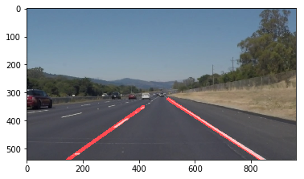

# **Finding Lane Lines on the Road** 

Overview
---

The aim of this project is to detect lane lines in a video, based on the knowledge gained through Udacity's teachings in the first week. The project is written in Python, and was tested in the Jupyter Notebook on the given input videos and images. The input videos were annotated by the red lane markings computed over the original content of the video.

[//]: # (Image References)

[image1]: ./writeup_images/1.png "Original"
[image2]: ./writeup_images/2.png "Grayscale"
[image3]: ./writeup_images/3.png "Blurred"
[image4]: ./writeup_images/4.png "Canny"
[image5]: ./writeup_images/5.png "Masked"
[image6]: ./writeup_images/6.png "Hough Lines"
[image7]: ./writeup_images/7.png "Final"
---

## Reflection

### Pipline Implementation

![alt text][image1]

The pipeline consists of 8 steps and is implemented in lane_line_detector().

1. The input image is converted to grayscale

  ![alt text][image2]

2. The Guassian Blur is applied to smooth the image and slightly remove noises. The kernel size was set to 5.

  ![alt text][image3]

3. Canny edge detection is used.

  ![alt text][image4]

4. A four sided polygon is created to mask the the image with detected edges 

  ![alt text][image5]

5. Lines in the image are extracted using the Hough transform with the following parameters:
    | Parameter | Value | Description
    | :-- | :--- | :---
    | rho | 2 | Distance resolution in pixels of the Hough grid
    | theta | Pi/180 | Angular resolution in radians of the Hough grid
    | threshold | 40 | Minimum number of votes (intersections in Hough grid cell)
    | min_line_length | 40 | Minimum number of pixels making up a line
    | max_line_gap | 150 | Maximum gap in pixels between connectable line segments

6. Lines are classified into left and right lines. In order to that, the minimum and maximum slopes of the lines in the image are obtained. Then those lines that fall within 70% of the minimum and maximum slopes are classified as the left and right lines.

7. The left and right side lines are extrapolated by averaging their slope and intercept respectively. This is done by changing the draw_lines() method. The result of steps 5, 6 and 7 is depicted in the following figure:

 ![alt text][image6]

8. The lines are overlayed on the input image to mark the lane.

 ![alt text][image7]

### Potential Shortcomings 

Lane lines are not always clearly marked or visible. Different lighting conditions and artifacts on the road might partially cover the lane markings. Additionally, in many situations where the road is under construction, the lanes are not properly and clearly marked. It might be necessary to distinguish between the yellow and white lane markings the detect the correct lane.

Another problem might appear when there are shadows or white lines in the image. This will cause the classification algorithm to not function properly. Therefore a better classification method is needed.

### Possible Improvements

A possible improvement would be to apply a better noise reduction method on the image to remove unwanted artifacts in the image. Also, it would more effecient to dynamically detect the thresholds and parameters according to the image characteristics, so that the detection of lines becomes more accurate. 
